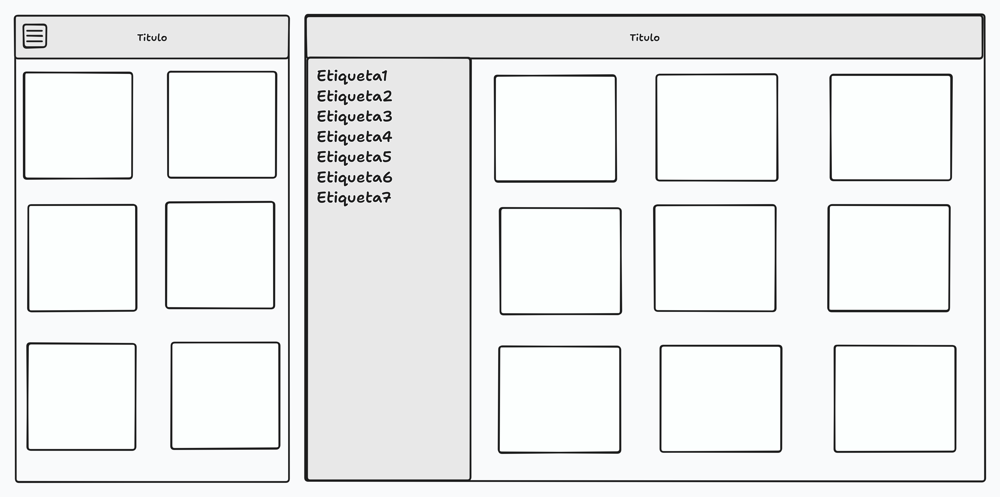

# Blog privado

## Necesidad

Crear desde cero un sitio privado de articulos con un control de acceso sencillo y envío de comentarios a cada articulo, los cuales se leen de un api.


## Profesión:

Desarollador Frontend.

## Competencias
Crear una interfaz de usuario web estática y adaptable.
Crear un algoritmo sencillo para autenticación.
Separación de datos y algoritmos

## Modalidad pedagógica

Trabajo individual.
Aprendizaje autónomo.

## Modalidad de evaluación

Revisión de entregables por parte del profesorado.


## Entregables

HTML y recursos (imágenes y css) en un repositorio github personal.

Para hacer la entrega, el alumnado deberá publicar el enlace al repositorio en el canal deberes-y-entregas de discord.

## Criterios de rendimiento
### Generales
- Toda la funcionalidad cubierta.
- Código correctamente indentado y limpio.
- Todos los tags correctamente abiertos/cerrados (https://validator.w3.org/).
- Comentarios de código donde se necesiten.
- Ficheros no-html en directorios aparte.
- Se valorará si se puede ver el avance a través de los commits.
- Se valorará si se puede ver la organización a través del kanban.
- Se valorará si se realizan tests que validen las funcionalidades.
- Se valorará si se utilizan web-components.


### HTML
- Crear un layout que utilice etiquetas semanticas
- Utilizar cabeceras y títulos
- Utilizar hypervínculos a otras webs, sin salir de la actual
- Que contenga imágenes
- Que el conteido sea coherente

### CSS
- Utilizar diferentes colores web definidas en variables
- Utiliza reglas CSS para cambiar el color o la imágen del fondo de algún elemento
- Utiliza diferentes tipografías con variedad de estilos y tamaños
- La web debe de ser responsive
- Buscar coherencia de estilo

### FORMULARIOS
- Crear un formulario que permita recoger datos de usuarios y que los envíe por GET
- Utilizar diferentes tipos de etiquetas de datos, con variedad de tipos
- Colocar una casilla de verificación que suponga la aceptación de la política de privacidad
- Las etiquetas utilizadas deben contener atributos específicos del formulario

### JAVASCRIPT
- Crear funciones diferenciadas por sus diferentes comportamientos
- Crear código coherente y ordenado (Clean Code).
- Utilizar objetos, métodos y atributos que inteactuen con el DOM
- Utilizar eventos para ejecutar acciones y scripts cuando carga la página.

### Varios
- Definir historias de usuario y reflejar el avance el kanban 
- Aplica las técnicas de optimización y no duplicacion de código
- Realizar test de funciones
- Validar el funcionamiento general de la web.
- Utilización de estrategias SEO para optimizar el posicionamiento de buscadores y mejorar el rendimiento


## Descripción de las tareas a realizar:

Realizar una web siga el siguiente diagrama de flujo:


Toda la web ha de ser responsiva.

La página index es una ṕagina que muestra lo que es el blog privado y da acceso tanto al login, como al repositorio. Éste último, en otra pestaña.

La página en la que se hace login y parecerse a esto:


El botón de "Login" ha de estar desabilitado si no se aceptan las condiciones.

Los usuarios se almacenan en en el archivo `users.json`

El blog ha de ser una página que muestre las tarjetas de los artículos. Se podrán filtrar por las etiquetas definidas.


Estas tarjetas serán web-components.

Al pulsar en cada tarjeta, el usuario será llevado a la página del artículo para que pueda ver el contenido.

El artículo ha de ser una página que muestre la información del articulo.


En ésta página, ha de encontrarse un mecanismo para dar feedback del artículo.

El feedback se realizará via email al email del autor, rellenando el email , el asunto y el principio del cuerpo del email.

### A tener en cuenta
#### Formato de `users.json`
```
[
    { "username": "aaaaa", "password": "aaaaa" },
    ...
]
```
#### Formato de `articles.json`
```
[
    { 
        "image": "aaaaa.aaa"
        "title": "aaaaa",
        "date": "YYYY-MM-DD",
        "author": {
            "name": "aaaaa",
            "mail": "aaa@aaa.org"
        },
        "content" : "Lorem Ipsum....",
        "labels": ["aaaaa", "bbbbb"]
    },
    ...
]
```

#### Gestión del tiempo
- Se dispone de poco tiempo por lo que éste deberá ser gestionado adecuadamente.
- Prioriza la funcionalidad.
- Es preferible una interfaz sencilla pero funcional que otra preciosa y recargada, que no funcione.
- Recuerda que cuantos más elementos tengas en la pantalla, más tendrás que gestionar.